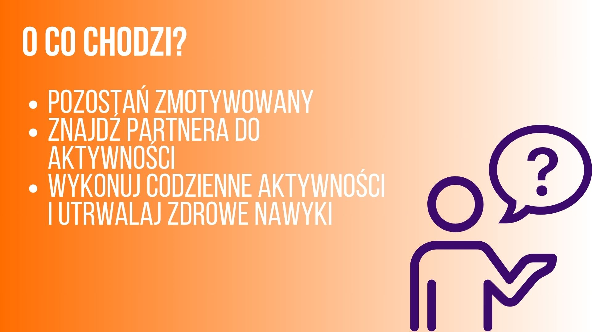

Projekt zamieszczonej aplikacji został wykonany w trakcie dziesiątej edycji HackYeah w kategorii wellnes and activities.

Aplikacja ta ma na celu zachęcać do zwiększania aktywności ruchowej użytkowników na dwa istotne sposoby. Po pierwsze ma ułatwiać znajdowanie osób do wspólnych ćwiczeń grupowych. Dzięki niej możemy na przykład znaleźć osoby do uczęszczania na zajęcia z tańca, tenisa lub zebrać drużynę do gry w piłkę nożną. Drugą z funkcjonalności ma być zachęcanie do indywidualnego zwiększania aktywności fizycznej, zarówno spontanicznych takich jak wybieranie spacerów do pracy oraz zaplanowanych jak wyjście na siłownię, czy pójście na basen.

Autorzy:

Jakub Nowakowski, Marcin Warchoł, Lidia Stachurska, Krzysztof Gądek, Adam Nowak, Maciej Nowakowski.

Link do materiału video prezentujący zarówno projekt wykonany w Figmie jak i uruchomiony kod: https://www.youtube.com/watch?v=_0Qn8sMmHUA

Aby móc uruchomić nasze oprogramowanie należy na początku zainstalować wszystkie potrzebne
dependencje przy pomocy komendy: npm install.

Następnie należy uruchomić aplikację przy pomocy npx expo start.

Aplikacja została zaprojektowana z myślą oużytkowniakch mobilnych. W związku z tym potrzeba telefon aby móc ją uruchomić. Aby załadowała się na nasz telefon należy zeskanować pojawiający się w terminalu kod QR wykorzystując do tego aplikację Expo Go i uruchamiając ją będąc połączonym z tą samą siecią, z którą połączony jest komputer.
